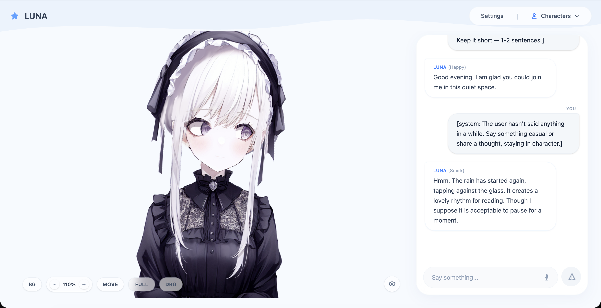

# MeuxCompanion

A self-hosted AI companion web app with anime-style Live2D and VRM characters. Talk with your companion via text or voice — they respond with expressive facial animations, lip-synced speech, and per-sentence emotional reactions.

> **Rework of [MeuxVtuber](https://github.com/meuxtw/MeuxVtuber)** — evolved from a YouTube chat VTuber bot into a full interactive companion experience.



## Features

### Core
- **Live2D & VRM model support** — use 2D (Live2D Cubism) or 3D (VRM) anime characters
- **Per-sentence expression changes** — character changes facial expression with each sentence, not just once per response
- **Audio-driven lip sync** — mouth movement follows actual speech audio via Web Audio API frequency analysis
- **Streaming responses** — text appears word-by-word as the LLM generates, TTS runs in parallel per sentence

### Interaction
- **Voice input** — speak via microphone using Web Speech API
- **Idle chatter** — character greets you on load and initiates conversation if you're quiet
- **Typing awareness** — character tilts head curiously when you're typing
- **Idle animations** — breathing, blinking, eye saccades, body sway, random pose shifts

### Customization
- **Guided onboarding** — step-by-step setup wizard for first-time users (name, LLM provider, character creation)
- **In-app settings** — configure LLM, TTS, and expression mappings without editing files
- **Multi-provider support** — switch between configured LLM and TTS providers with saved per-provider settings
- **Expression mapping UI** — visually preview and assign model expressions to emotions
- **Customizable backgrounds** — preset gradients or custom colors
- **Model viewport controls** — zoom, fullscreen, move/reposition, and debug overlays

### Providers
- **Any OpenAI-compatible LLM** — works with OpenAI, Groq, Ollama, OpenRouter, Nectara, or any custom endpoint
- **Multiple TTS engines** — TikTok TTS (free, no API key), ElevenLabs, or OpenAI TTS
- **Zero cost option** — use free TTS (TikTok) + free LLM providers (Nectara, Ollama)

## Quick Start

### Prerequisites

- Python 3.10+
- Node.js 18+

### Setup

```bash
# Clone the repo
git clone https://github.com/meuxtw/MeuxVtuber.git
cd MeuxVtuber

# Set up Python environment
python -m venv .venv
source .venv/bin/activate  # or .venv\Scripts\activate on Windows
pip install -r requirements.txt

# Set up frontend
cd frontend
npm install
npm run build
cd ..
```

### Run

```bash
python main_app.py
# Open http://localhost:8000
```

On first launch, the **onboarding wizard** will guide you through:
1. Setting your name
2. Choosing an LLM provider and API key
3. Creating your first companion character

### Development Mode

```bash
# Terminal 1: Backend
python main_app.py

# Terminal 2: Frontend (hot reload)
cd frontend && npm run dev
# Open http://localhost:5173
```

## Configuration

All configuration is managed through the **in-app Settings panel** — no need to edit files manually.

### LLM Providers

Configure via **Settings > LLM Provider**. Supported providers:

| Provider | Base URL | API Key Required |
|----------|----------|:---:|
| OpenAI | `https://api.openai.com/v1` | Yes |
| Groq | `https://api.groq.com/openai/v1` | Yes |
| Ollama (local) | `http://localhost:11434/v1` | No |
| OpenRouter | `https://openrouter.ai/api/v1` | Yes |
| Nectara (free) | `https://api-nectara.chipling.xyz/v1` | Yes |
| Custom | Any OpenAI-compatible URL | Varies |

You can configure multiple providers and switch between them — each provider's settings (API key, model) are saved independently.

### TTS Providers

Configure via **Settings > Voice & TTS**:

| Provider | API Key Required | Notes |
|----------|:---:|-------|
| TikTok TTS | No | Free, many voices, default |
| ElevenLabs | Yes | High-quality, natural voices |
| OpenAI TTS | Yes | alloy, echo, fable, onyx, nova, shimmer |

### Characters

Characters are defined as `.md` files in `characters/`:

```markdown
---
name: Rika
live2d_model: haru
voice: jp_001
---

## Personality
A tsundere anime girl who loves anime but won't admit it...

## Speech Style
- Uses "b-baka!" when embarrassed
- Energetic and dramatic
```

You can also create characters through the **onboarding wizard** or by adding `.md` files directly.

### Adding Models

**Live2D models** — drop the model folder into `models/live2d/`:
```
models/live2d/my_model/
  model.model3.json
  model.moc3
  textures/
  expressions/
```

**VRM models** — drop `.vrm` files into `models/vrm/`:
```
models/vrm/my_model/
  character.vrm
  animations/        # Optional Mixamo FBX files
    idle.fbx
    talking.fbx
```

### Expression Mapping

Open **Settings > Expression Mapping** in the app:
1. Preview each model expression by clicking it
2. Map global emotions (happy, sad, angry...) to model-specific expressions
3. Save — the LLM will tag each sentence with the appropriate expression automatically

> Models with unmapped expressions will show a prompt to configure them before chatting.

## Architecture

```
Browser                              FastAPI Server
┌─────────────────────┐              ┌──────────────────┐
│  Live2D / VRM Canvas│              │  /api/chat/stream│
│  (PixiJS / Three.js)│◄── SSE ────►│  ├─ LLM (stream) │
│                     │              │  ├─ Sentence split│
│  Chat Panel         │              │  └─ TTS (parallel)│
│  Audio Queue        │              │                  │
│  Expression System  │              │  /api/config     │
│  Settings/Onboarding│              │  /api/expressions│
└─────────────────────┘              └──────────────────┘
```

**Per-sentence reactive pipeline:**
1. LLM streams tokens with inline `<<expression>>` tags
2. Backend splits on expression boundaries in real-time
3. Each sentence gets its own TTS thread (parallel generation)
4. Audio events are sent via SSE as soon as each TTS completes
5. Frontend queues audio and plays sequentially, switching expressions at each boundary

## Tech Stack

| Layer | Technology |
|-------|-----------|
| Frontend | React + Vite + TypeScript + Tailwind CSS |
| Live2D | pixi-live2d-display + PixiJS |
| VRM/3D | Three.js + @pixiv/three-vrm |
| Backend | FastAPI (Python) |
| LLM | OpenAI SDK (any compatible provider) |
| TTS | TikTok TTS / ElevenLabs / OpenAI TTS |
| STT | Web Speech API (browser) |
| Storage | Local `.md` and `.json` files |

## Project Structure

```
MeuxCompanion/
├── main_app.py              # FastAPI entry point
├── requirements.txt
├── config.json              # Auto-managed app configuration
├── assets/                  # Screenshots and demo media
│
├── backend/
│   ├── api/                 # API endpoints
│   │   ├── chat.py          # Streaming chat with per-sentence TTS
│   │   ├── config.py        # Config CRUD, provider switching
│   │   ├── tts.py           # Text-to-speech
│   │   ├── characters.py    # Character CRUD
│   │   └── expressions.py   # Expression mapping
│   ├── services/            # Business logic
│   │   ├── config.py        # Multi-provider config management
│   │   ├── llm.py           # LLM client (OpenAI SDK)
│   │   ├── tts.py           # TikTok / ElevenLabs / OpenAI TTS
│   │   ├── character.py     # Character loading with caching
│   │   └── expressions.py   # Expression mapping system
│   └── utils/
│       └── emotion.py       # Expression tag parsing
│
├── frontend/src/
│   ├── App.tsx              # Main app shell & state management
│   ├── index.css            # Global styles & animations
│   ├── components/
│   │   ├── Live2DCanvas.tsx  # Live2D renderer with idle animations
│   │   ├── VRMCanvas.tsx     # VRM 3D renderer with FBX animations
│   │   ├── ChatPanel.tsx     # Chat interface with streaming
│   │   ├── Onboarding.tsx    # First-run setup wizard
│   │   ├── Settings.tsx      # In-app configuration panel
│   │   ├── ModelSettings.tsx  # Expression mapping UI
│   │   ├── CharacterSelect.tsx # Character switcher dropdown
│   │   ├── LoadingOverlay.tsx  # Loading states
│   │   └── MicButton.tsx     # Voice input toggle
│   ├── hooks/
│   │   ├── useChat.ts        # Streaming chat with SSE
│   │   ├── useAudioQueue.ts  # Per-sentence audio playback
│   │   ├── useLive2D.ts      # Live2D animations & viewport
│   │   ├── useVRM.ts         # VRM animations + FBX loading
│   │   ├── useVoice.ts       # Voice input (Web Speech API)
│   │   └── useAudioAnalyser.ts # Audio frequency analysis
│   └── utils/
│       └── mixamoRigMap.ts   # Mixamo→VRM bone mapping
│
├── characters/               # Character definitions (.md)
├── models/
│   ├── live2d/              # Live2D models
│   ├── vrm/                 # VRM models
│   └── expression_mappings/ # User expression configs
└── chats/                   # Chat history storage
```

## API Reference

| Endpoint | Method | Description |
|----------|--------|-------------|
| `/api/chat/stream` | POST | Stream LLM response with per-sentence TTS |
| `/api/config` | GET/POST | Read/update app configuration |
| `/api/config/presets` | GET | List available LLM and TTS presets |
| `/api/config/configured` | GET | Check which providers are configured |
| `/api/config/switch-llm` | POST | Quick-switch active LLM provider |
| `/api/config/switch-tts` | POST | Quick-switch active TTS provider |
| `/api/config/test-llm` | POST | Test LLM connection |
| `/api/characters` | GET | List all characters |
| `/api/characters/create` | POST | Create a new character |
| `/api/voices/{provider}` | GET | List voices for a TTS provider |
| `/api/expressions/mapping` | GET/POST | Read/save expression mappings |
| `/api/expressions/configured/{model}` | GET | Check if model expressions are mapped |
| `/api/models` | GET | List available Live2D/VRM models |

## License

MIT
